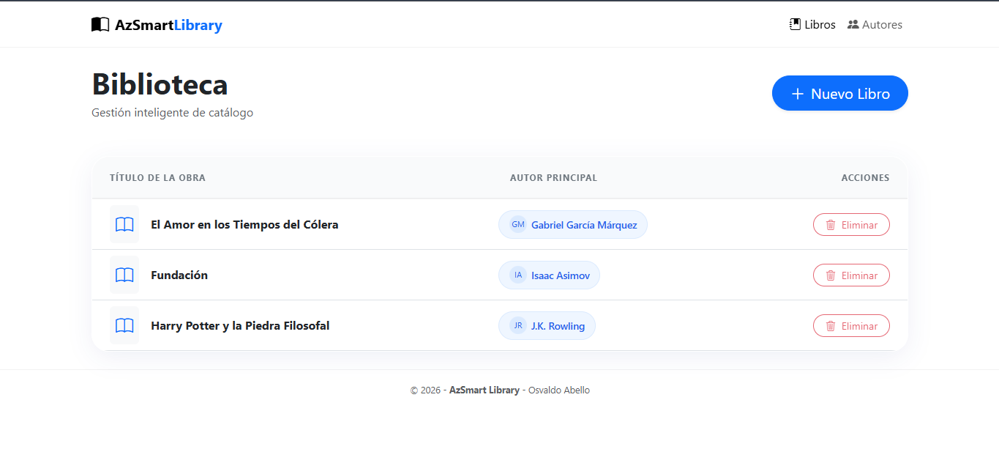
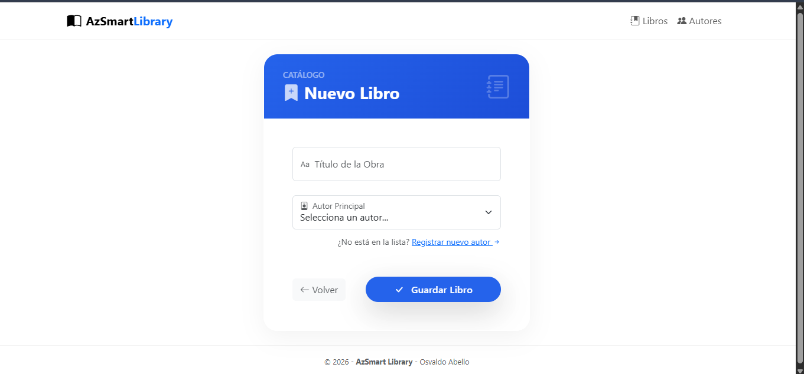
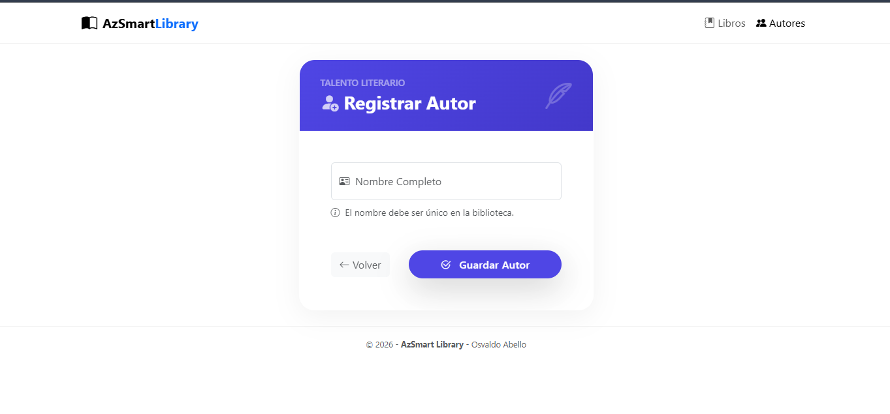

# 📚 AzSmartLibrary


<p align="center">
  
  
  
  
  
</p>

AzSmartLibrary — Sistema Inteligente de Gestión de Bibliotecas desarrollado con ASP.NET Core y Clean Architecture. Diseñado para ser seguro, escalable y mantenible, con un enfoque en buenas prácticas (SOLID, DI, separación de responsabilidades).

---

## ✨ Resumen rápido

- Plataforma: ASP.NET Core (MVC) · .NET 10
- Arquitectura: Clean Architecture (Presentation → Application → Core → Infrastructure)  
- Persistencia: Entity Framework Core (Code-First) · SQL Server   

---

## 📦 Estructura del proyecto

Estructura principal (resumen):

- AzSmartLibrary.Web — Presentación (Controllers, Views Razor, ViewModels)  
- AzSmartLibrary.Application — Lógica de aplicación, DTOs, casos de uso  
- AzSmartLibrary.Core — Entidades de dominio, reglas de negocio, interfaces de repositorio  
- AzSmartLibrary.Infrastructure — EF Core, migraciones, implementación de repositorios, seed data

Modelo de datos (ERD):  


---

## 🚀 Características destacadas

- Gestión de Autores y Libros (Alta, Baja lógica, Edición)  
- Selector dinámico de autores al crear o editar libros  
- Validaciones en cliente y servidor con Data Annotations  
- Interfaz responsive basada en Bootstrap   
- Código organizado según principios SOLID y patrones de Clean Architecture

---

## 🔧 Requisitos

- Visual Studio 2026  (carga de trabajo "ASP.NET y desarrollo web")  
- .NET 10 SDK  
- SQL Server (LocalDB, Express o Developer)  
- Herramientas: EF Core Tools (Package Manager Console o dotnet-ef)

---

## 🏁 Quick Start (Desarrollo local)

1. Clona el repositorio
```bash
git clone https://github.com/Edwin0422-FullEstack/AzSmartLibrary.git
cd AzSmartLibrary
```

2. Abre la solución `AzSmartLibrary.sln` en Visual Studio y establece `AzSmartLibrary.Web` como proyecto de inicio.

3. Configura la cadena de conexión:
- Edita `src/AzSmartLibrary.Web/appsettings.Development.json` y verifica `DefaultConnection`:

```json
{
  "ConnectionStrings": {
    "DefaultConnection": "Server=(localdb)\\mssqllocaldb;Database=AzSmartLibraryDB;Trusted_Connection=True;MultipleActiveResultSets=true"
  }
}
```

4. Ejecuta las migraciones y el seed de datos:
- Usando Package Manager Console (PM>):
```powershell
# Selecciona como proyecto predeterminado:
# src\AzSmartLibrary.Infrastructure
Update-Database -StartupProject AzSmartLibrary.Web
```
- O usando dotnet-ef:
```bash
cd src/AzSmartLibrary.Infrastructure
dotnet ef database update --startup-project ../AzSmartLibrary.Web
```

5. Ejecuta la aplicación (F5 o Ctrl+F5). Accede en el navegador a `https://localhost:5001` o la URL que Visual Studio asigne.

---

---

## 📄 Script SQL (Entregable Adicional)

Aunque el proyecto gestiona la base de datos automáticamente mediante **EF Core Migrations** (Code-First), se incluye el script SQL crudo como se solicita en los requisitos técnicos de la prueba.

Este script contiene todas las sentencias DDL para:
1.  Crear la base de datos `AzSmartLibraryDB`.
2.  Definir las tablas `Authors` y `Books` con sus relaciones (PK/FK).
3.  Insertar datos de prueba iniciales (Seed Data).

**Ubicación del archivo:**
`src/AzSmartLibrary.Infrastructure/sql/script.sql`

> **Nota:** Si prefieres no usar migraciones, puedes ejecutar este script directamente en tu instancia de SQL Server Management Studio (SSMS) para levantar el entorno de datos inmediatamente.

## ⛑️ Despliegue y producción

- Reemplaza la cadena de conexión con una instancia de SQL Server accesible desde el hosting (Azure SQL, VM, etc.).  
- Asegura secretos y cadenas de conexión con variables de entorno o Azure Key Vault.  

---

## 📸 Capturas

Incluye screenshots de las vistas en `docs/screenshots/`. Ejemplo de carpetas sugeridas:
- docs/screenshots/catalog.png
- 
- docs/screenshots/new-book.png

- docs/screenshots/new-autor.png


## 👨‍💻 Autor

Osvaldo Abello — Desarrollador .NET  
- GitHub: [Edwin0422-FullEstack](https://github.com/Edwin0422-FullEstack)

---

## Contacto / Soporte

¿Preguntas o mejoras? 
